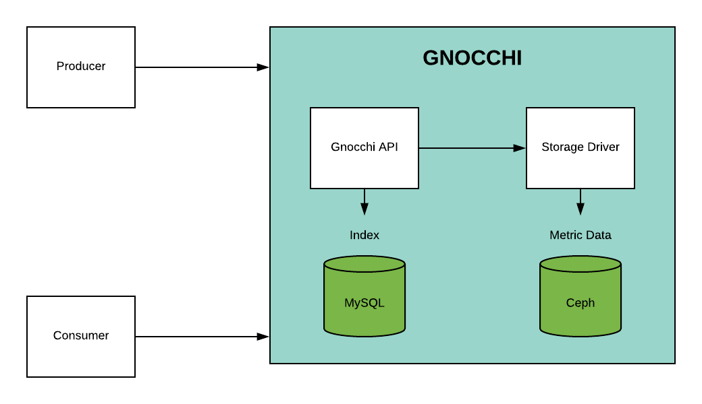
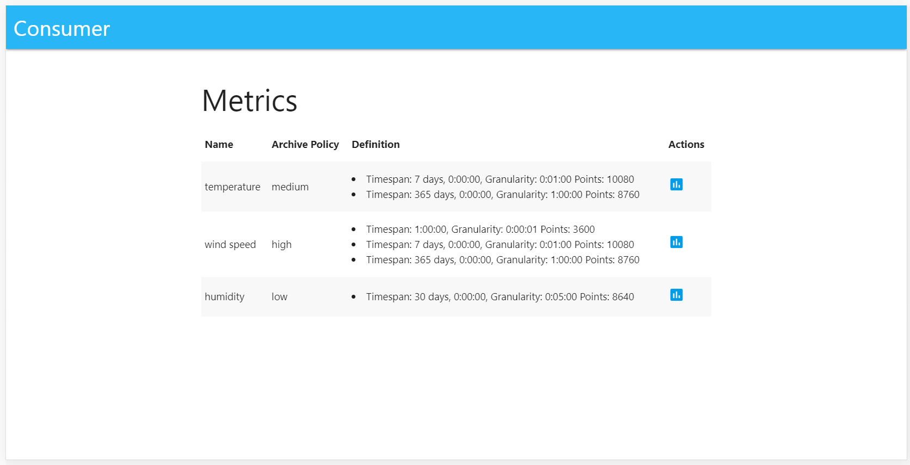
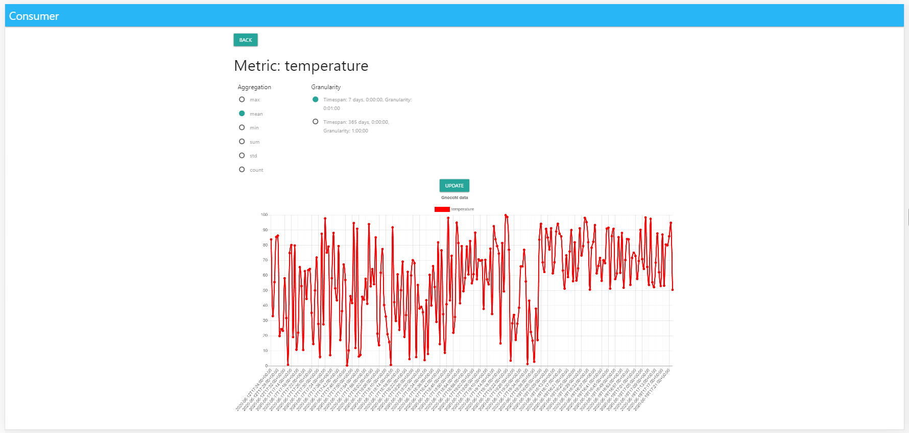
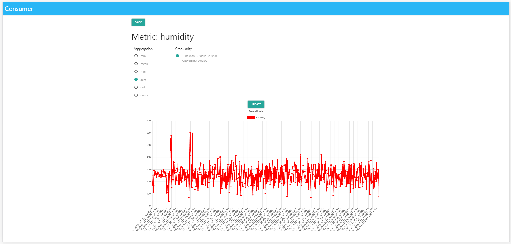
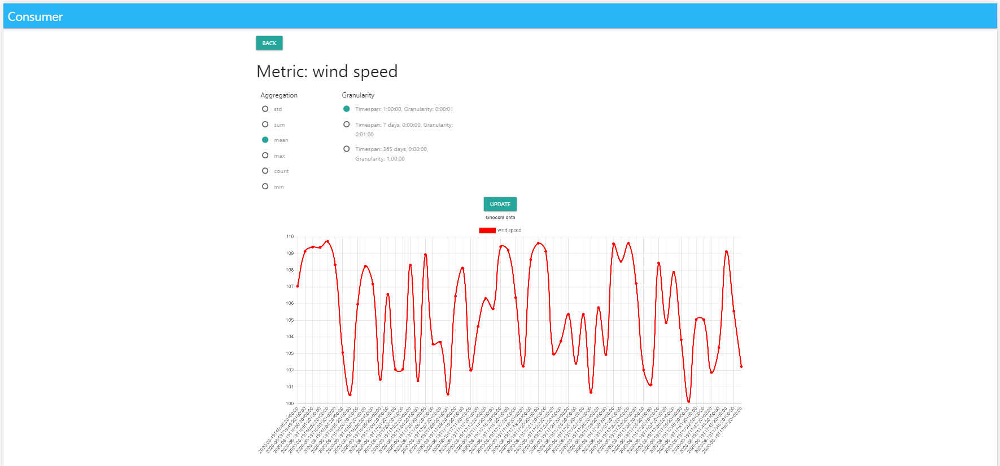

# Cloud Computing

An OpenStack instance implemented the Gnocchi open-source time series database with Ceph. Two types of applications were developed in this repository.

- Consumer development using [DJango Web Framework](https://www.djangoproject.com/) that retrieved from Gnocchi REST API periodically some aggregated values like average, max, min, sum, std, count;  
- Producer development with [Python](https://www.python.org/) that store on Gnocchi REST API random numbers for three different metrics: _Tempeture_, _Huminity_, _Wind Speed_

## Gnocchi Introduction

Gnocchi is an open-source time series database.

The problem that Gnocchi solves is the storage and indexing of time series data and resources at a large scale. This is useful in modern cloud platforms which are not only huge but also are dynamic and potentially multi-tenant. Gnocchi takes all of that into account.

Gnocchi has been designed to handle large amounts of aggregates being stored while being performant, scalable and fault-tolerant. While doing this, the goal was to be sure to not build any hard dependency on any complex storage system.

Gnocchi takes a unique approach to time series storage: rather than storing raw data points, it aggregates them before storing them. This built-in feature is different from most other time series databases, which usually support this mechanism as an option and compute aggregation (average, minimum, etc.) at query time.

Because Gnocchi computes all the aggregations at ingestion, getting the data back is extremely fast, as it just needs to read back the pre-computed results.

### Glosary 

* **Aggregate**: A datapoint tuple generated from several measures according to the archive policy definition. It is composed of a timestamp and a value.
* **Aggregation method**: Function used to aggregate multiple measures into an aggregate. For example, the min aggregation method will aggregate the values of different measures to the minimum value of all the measures in the time range.
* **Archive policy**: An aggregate storage policy attached to a metric. It determines how long aggregates will be kept in a metric and how they will be aggregated.
* **Granularity**: The time between two aggregates in an aggregated time series of a metric.
* **Measure**: An incoming datapoint tuple sent to Gnocchi by the api. It is composed of a timestamp and a value.
* **Metric**: An entity storing aggregates identified by an UUID. It can be attached to a resource using a name. How a metric stores its aggregates is defined by the archive policy it is associated to.
* **Resource**: An entity representing anything in your infrastructure that you will associate metric(s) with. It is identified by a unique ID and can contain attributes.
* **Time series**: A list of aggregates ordered by time.
* **Timespan**: The time period for which a metric keeps its aggregates. It is used in the context of archive policy.

### Default archive policies

By default, 4 archive policies are created when calling gnocchi-upgrade: bool, low, medium and high. The name both describes the storage space and CPU usage needs.

* **low**
  * 5 minutes granularity over 30 days
  * aggregation methods used: default_aggregation_methods
  * maximum estimated size per metric: 406 KiB
* **medium** 
  * 1 minute granularity over 7 days
  * 1 hour granularity over 365 days
  * aggregation methods used: default_aggregation_methods
  * maximum estimated size per metric: 887 KiB
* **high**
  * 1 second granularity over 1 hour
  * 1 minute granularity over 1 week
  * 1 hour granularity over 1 year
  * aggregation methods used: default_aggregation_methods
  * maximum estimated size per metric: 1 057 KiB
* **bool**
  * 1 second granularity over 1 year
  * aggregation methods used: last
  * maximum optimistic size per metric: 1 539 KiB
  * maximum pessimistic size per metric: 277 172 KiB

### Comparisons To Alternatives

Features	                    |Gnocchi	    |Prometheus	|InfluxDB	        |OpenTSDB	|Graphite|
|---|---|---|---|---|---|           
|Metric polling	              |No	          |Yes        |No	                |No	    |No|
|Resource history	            |Yes	        |No	        |No	                |No	    |No|
|Multi-tenant	                |Yes	        |No	        |No	                |No	    |No|
|Query interface	            |REST API	    |REST API	  |HTTP	              | TCP	  |None|
|High-available	              |Yes	        |No	        |With Relay	        |Yes	  |No|
|Scalable	                    |Yes	        |No	        |Commercial only	  |Yes	  |No|
|Alerting	                    |No (roadmap)	|Yes	      |With Kapacitor	    |No	    |No|
|Grafana support	            |Yes	        |Yes        |Yes                |Yes	  |Yes|
|collectd support	            |Yes	        |Yes        |Yes                |Yes	  |Yes|

## Poject Specifications

### OpenStack: Timeseries as a service

Install an OpenStack instance the Gnocchi database and create two simple applications, one consumer and one producer, that exploit the REST interface exposed by Gnocchi to  the data. The producer must mimic the periodic production of measurement data (random data is OK) to be stored in the timeseries database, the consumer must retrieve periodically some aggregated values like average, max, min, sum, std, count.

You can read the full documentation online:

- [Gnocchi official documentation](http://gnocchi.osci.io)
- [Gnocchi installation](https://jaas.ai/gnocchi/37)
- [Gnocchi REST interface](https://gnocchi.xyz/rest.html)

Architecture Gnocchi with this solution:



### Application Screenshot

- Index

On this web page you can see the three different metrics _Tempeture_ with policy _medium_, _Huminity_ with policy _high_, _Wind Speed_ with policy _low_



- Tempeture Graph



- Huminity Graph



- Wind Speed Graph



### How run the application
#### Producer.py

* Example run command:
```ssh
python producer.py --min 10 --max 100 --date 2020-06-11T13:32:51 --id ca3ac69a-67d0-4bd4-bd8b-22debdab0fb3 --sec 15
```

### Credits

This project was developed by University of Pisa Students: [@fxisco](https://github.com/fxisco), [@fabianaritorti](https://github.com/fabianaritorti), [@luigiarena](https://github.com/luigiarena), [@MarshaGomez](https://github.com/MarshaGomez)
